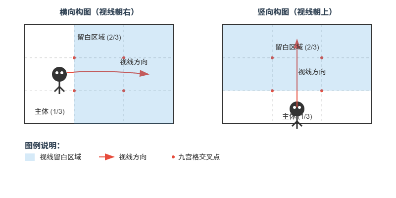

## 构图技巧

### 技巧一 视线留白

视线留白（也称为“视线空间”、“引导空间”或“呼吸空间”）是一种重要的构图技巧，特指在拍摄人物、动物或其他具有明确视线方向的主体时，在主体视线所朝向的方向预留出一定的空白区域。

简单来说：**让主体看的地方有“空间”，而不是被画面边缘“堵死”**。
    **也就是不要让照片上视线所对的方向，紧贴边缘**

选择干净、简洁的背景（如天空、水面、纯色墙、虚化背景）作为视线留白区域。
`大胆留白`： 不要害怕留白区域过大。有时，大面积的留白是营造特定氛围（如孤独、辽阔、宁静）的强有力手段。

#### 构图步骤：
- 确定主体视线方向（左/右/上/下）。
- 将主体放在视线反侧的交叉点（如视线朝右→主体放左侧）。
  确保视线前方有≥2/3的画面空间。
- 留白内容：
  横向：天空、海面、草地、虚化背景。
  竖向：天空、建筑顶部、山脉。

**口诀：**“视线朝哪边，主体放对面；留白占大半，画面才舒展。”

:::image-figure

:::

### 技巧二 仰拍构图

天空大地比例2比1,人物在右侧或者左侧三分线上即可

## 建筑物拍照
### 技巧一 

人与建筑物之间，与摄影师之间的距离把控好，打开五倍，人物切记不要放在中间九宫格，一定是左下或者右下

